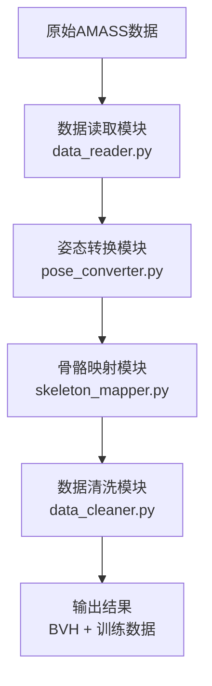

# AMASS数据预处理模块说明文档

## 📋 概述

本项目提供了一套完整的AMASS数据预处理工具包，按照标准的数据处理流程设计：
**数据读取 → 姿态转换 → 骨骼映射 → 数据清洗与异常处理**

## 🏗️ 模块架构

### 核心处理流程



### 文件结构

```
dataSet_Preprocess/
├── data_reader.py           # 数据读取模块 ⭐
├── pose_converter.py        # 姿态转换模块 ⭐
├── skeleton_mapper.py       # 骨骼映射模块 ⭐
├── data_cleaner.py          # 数据清洗模块 ⭐
├── preprocessing_pipeline.py # 主流程控制模块 ⭐
├── pose_mapper.py           # 兼容性姿态映射模块
├── process_examples.py      # 兼容性处理示例
├── dataset.py              # 兼容性数据集工具
├── dataset_config.py       # 兼容性配置工具
├── __init__.py             # 模块导出配置
└── PREPROCESSING_USAGE.md  # 本使用说明
```

## 🎯 核心模块功能

### 1. 数据读取模块 (data_reader.py) ⭐⭐⭐⭐⭐

**功能特性：**
- 递归扫描AMASS数据集目录
- 加载.npz文件并验证完整性
- 提取数据集统计信息
- 文件完整性验证

**核心类：**
```python
class AMASSDataReader:
    def scan_dataset(self, max_files=None, file_pattern="*.npz")
    def load_amass_file(self, file_path)
    def get_dataset_statistics(self)
    def validate_file_integrity(self, file_path)
```

### 2. 姿态转换模块 (pose_converter.py) ⭐⭐⭐⭐⭐

**功能特性：**
- 轴角 ↔ 旋转矩阵 ↔ 欧拉角转换
- 姿态数据提取和重塑
- 旋转表示标准化
- 姿态数据分析和验证

**核心类：**
```python
class PoseConverter:
    def extract_body_poses(self, poses_data)
    def poses_to_rotation_matrices(self, body_poses)
    def poses_to_euler_angles(self, body_poses, order='zxy')
    def analyze_pose_statistics(self, poses_data)
    def validate_pose_data(self, poses_data)
```

### 3. 骨骼映射模块 (skeleton_mapper.py) ⭐⭐⭐⭐⭐

**功能特性：**
- SMPL 24关节 → 项目22关节映射
- 融合映射（脊柱融合）
- 新建关节生成（脚趾关节）
- BVH文件生成
- 训练数据标准化

**核心类：**
```python
class SkeletonMapper:
    def map_joints(self, smpl_rotations)
    def compute_local_rotations(self, global_rotations)
    def normalize_training_data(self, local_rotations)
    def save_bvh_file(self, euler_angles, root_translations, output_path)
    def process_skeleton_mapping(self, smpl_rotations, root_translations)
```

### 4. 数据清洗模块 (data_cleaner.py) ⭐⭐⭐⭐⭐

**功能维度：**

1. **数据有效性检查**
   - 缺失值/NaN值检测
   - 静态数据检测

2. **生物力学合理性检查**
   - 关节角极限检测
   - 肢体扭曲检测

3. **运动学质量检查**
   - 过度抖动检测
   - 足部滑步检测

4. **质量评分与报告**
   - 综合质量评分（0-100分）
   - 详细质量报告生成

**核心类：**
```python
@dataclass
class DataQualityReport:
    file_path: str
    quality_score: float
    # ... 其他字段

class DataCleaner:
    def check_data_validity(self, poses, trans)
    def check_biomechanical_reasonableness(self, poses)
    def check_motion_quality(self, poses, trans, framerate)
    def clean_single_file(self, file_data, output_dir=None)
```

### 5. 主流程控制模块 (preprocessing_pipeline.py) ⭐⭐⭐⭐⭐

**功能特性：**
- 整合完整处理流程
- 支持单文件、批量、数据集处理
- 灵活的处理选项配置
- 详细的处理统计和报告

**核心类：**
```python
class PreprocessingPipeline:
    def process_single_file(self, input_file, output_dir, **options)
    def process_batch(self, input_files, output_dir, **options)
    def process_dataset(self, output_dir, max_files, **options)
    def get_dataset_overview(self)
```

## 🚀 快速开始

### 1. 基础使用

```python
from dataSet_Preprocess import PreprocessingPipeline

# 创建处理流水线
pipeline = PreprocessingPipeline(
    dataset_root=r"D:\LAB\Pose\PoseGeneration-Core\dataset\AMASS"
)

# 处理单个文件
result = pipeline.process_single_file(
    input_file="path/to/file.npz",
    output_dir="./output",
    generate_bvh=True,
    generate_training_data=True,
    perform_cleaning=True
)

print(f"处理成功: {result['success']}")
if result['quality_report']:
    print(f"质量评分: {result['quality_report']['quality_score']}/100")
```

### 2. 批量处理

```python
# 处理数据集中的文件
results = pipeline.process_dataset(
    output_dir="./processed_data",
    max_files=100,
    generate_bvh=True,
    generate_training_data=True
)

# 查看处理统计
success_count = sum(1 for r in results if r['success'])
print(f"成功处理: {success_count}/{len(results)}")
```

### 3. 命令行使用

```bash
# 查看数据集概览
python preprocessing_pipeline.py --mode overview

# 处理单个文件
python preprocessing_pipeline.py --mode single --input-file path/to/file.npz --output-dir ./output

# 批量处理示例文件
python preprocessing_pipeline.py --mode batch --max-files 10 --output-dir ./batch_output

# 处理整个数据集
python preprocessing_pipeline.py --mode dataset --max-files 100 --output-dir ./dataset_output
```

## 🛠️ 高级功能

### 模块化使用

```python
from dataSet_Preprocess import AMASSDataReader, PoseConverter, SkeletonMapper, DataCleaner

# 1. 数据读取
reader = AMASSDataReader()
file_data = reader.load_amass_file("path/to/file.npz")

# 2. 姿态转换
converter = PoseConverter()
body_poses = converter.extract_body_poses(file_data['poses'])
rot_mats = converter.poses_to_rotation_matrices(body_poses)

# 3. 骨骼映射
mapper = SkeletonMapper()
target_rotations = mapper.map_joints(rot_mats)

# 4. 数据清洗
cleaner = DataCleaner()
quality_report = cleaner.clean_single_file(file_data)
```

### 自定义配置

```python
# 自定义清洗阈值
custom_thresholds = {
    'nan_threshold': 1e-12,
    'knee_flexion_range': [5, 140],
    'angular_velocity_limit': 360,
    'similarity_threshold': 0.98
}

cleaner = DataCleaner(thresholds=custom_thresholds)
```

## 📊 输出格式

### 数据质量报告 (DataQualityReport)

```python
{
    'file_path': str,           # 文件路径
    'file_name': str,           # 文件名
    'total_frames': int,        # 总帧数
    'processing_time': str,     # 处理时间
    
    # 数据有效性检查结果
    'validity_issues': {
        'nan_check': {...},
        'static_check': {...},
        'overall_valid': bool,
        'issues_found': int
    },
    
    # 质量评分
    'quality_score': float,     # 0-100分
    'recommendation': str       # 处理建议
}
```

### 输出文件

1. **BVH文件** - 标准BVH动画文件，可直接导入Unity
2. **训练数据** - 标准化后的.npz文件，用于深度学习训练
3. **质量报告** - JSON格式的质量分析报告

## ⚙️ 配置参数

### 数据清洗阈值

```python
DEFAULT_THRESHOLDS = {
    # 数据有效性检查
    'nan_threshold': 1e-10,           # NaN/Inf检测阈值
    'static_variance_threshold': 1e-6, # 静态数据方差阈值
    
    # 生物力学合理性检查
    'knee_flexion_range': [0, 150],    # 膝关节屈伸范围(度)
    'elbow_flexion_range': [0, 150],   # 肘关节屈伸范围(度)
    'spine_rotation_threshold': 45,    # 脊柱旋转安全阈值(度)
    
    # 运动学质量检查
    'angular_velocity_limit': 720,     # 角速度限制(度/秒)
    
    # 数据集层面过滤
    'similarity_threshold': 0.95,      # 相似度阈值
}
```

### 质量评分标准

| 评分范围 | 等级 | 描述 | 建议 |
|---------|------|------|------|
| 90-100 | 优秀 | 数据质量极高 | 可直接用于训练 |
| 70-89 | 良好 | 数据质量良好 | 建议轻微后处理 |
| 50-69 | 一般 | 数据质量一般 | 需要数据清洗和修复 |
| 30-49 | 较差 | 数据质量较差 | 建议丢弃或大幅修正 |
| 0-29 | 很差 | 数据质量很差 | 强烈建议丢弃 |

## 📈 性能特点

### 处理能力
- **单文件处理**：约1-3秒（取决于帧数）
- **批量处理**：支持数千文件的规模化处理
- **内存效率**：流式处理，支持大数据集
- **扩展性**：模块化设计，易于功能扩展

### 资源消耗
- **CPU**：主要消耗在相似度计算和特征提取
- **内存**：峰值内存使用约为数据集大小的2-3倍
- **存储**：生成的报告和图表占用空间较小

## 🔧 故障排除

### 常见问题

**Q: 处理速度很慢怎么办？**
A: 可以尝试：
- 减少处理文件数量
- 调整阈值参数降低计算复杂度
- 使用更快的硬件

**Q: 内存不足如何解决？**
A: 
- 分批处理数据
- 减少同时处理的文件数量
- 关闭不必要的可视化功能

**Q: 质量评分总是很低怎么办？**
A:
- 检查阈值设置是否过于严格
- 查看具体的违规详情进行针对性调整
- 考虑数据本身的特性

## 📚 兼容性说明

为了保持向后兼容，保留了原有的核心接口：

```python
# 兼容性导入
from dataSet_Preprocess import PoseMapper, batch_process, process_single_file

# 原有代码仍可正常工作
mapper = PoseMapper()
result = mapper.process_file(input_file, output_bvh, output_training)
```

## 🆘 技术支持

如有问题，请：
1. 查看详细的错误日志
2. 检查输入数据格式是否正确
3. 验证配置参数是否合适
4. 联系开发团队或提交GitHub issue

---
*文档版本: 2.0.0*
*最后更新: 2024年*